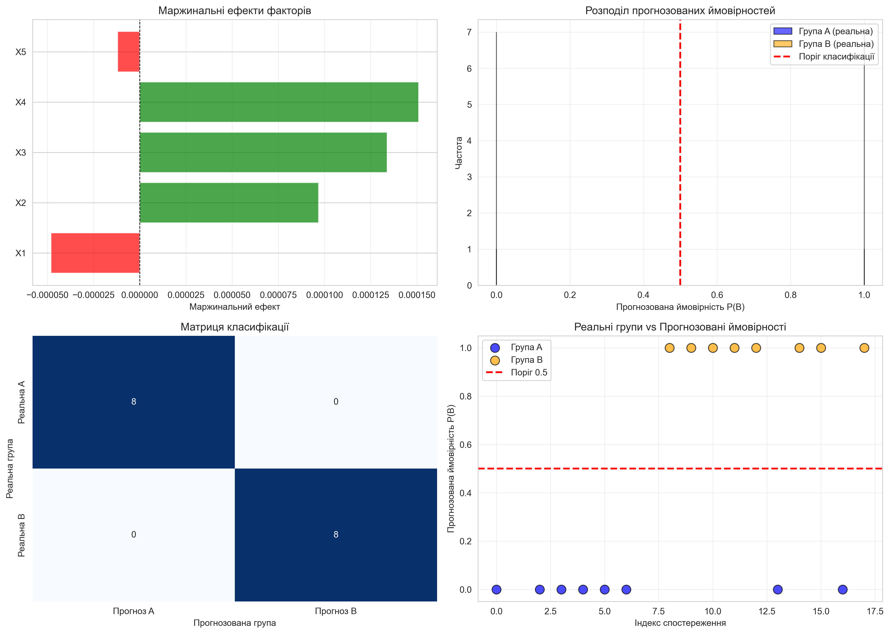

# ЗВІТ
## Лабораторна робота №6. Завдання 1. Варіант 9
### Побудова logit-моделі з дискретними залежними змінними

---

## 1. Мета роботи

Побудувати logit-модель для класифікації підприємств на дві групи (A та B) на основі п'яти економічних показників та провести всебічний аналіз моделі.

---

## 2. Вихідні дані

### 2.1. Економічні показники підприємств

Досліджуються 19 підприємств з наступними показниками:

- **X1** – продуктивність праці
- **X2** – питома вага робітників у складі промислово-виробничого персоналу
- **X3** – коефіцієнт змінності обладнання
- **X4** – питома вага втрат від браку
- **X5** – фондовіддача активної частини основних виробничих фондів

**Таблиця 1. Вихідні дані**

| № підприємства | X1    | X2   | X3   | X4   | X5   |
|----------------|-------|------|------|------|------|
| 1              | 9.26  | 0.78 | 1.37 | 0.23 | 1.45 |
| 2              | 9.38  | 0.75 | 1.49 | 0.39 | 1.30 |
| 3              | 12.11 | 0.68 | 1.44 | 0.43 | 1.37 |
| 4              | 10.81 | 0.70 | 1.42 | 0.18 | 1.65 |
| 5              | 9.35  | 0.62 | 1.35 | 0.15 | 1.91 |
| 6              | 9.87  | 0.76 | 1.39 | 0.34 | 1.68 |
| 8              | 9.12  | 0.71 | 1.27 | 0.09 | 1.89 |
| 12             | 5.49  | 0.74 | 1.10 | 0.05 | 1.02 |
| 14             | 6.61  | 0.72 | 1.23 | 0.48 | 0.88 |
| 15             | 4.32  | 0.68 | 1.39 | 0.41 | 0.62 |
| 16             | 7.37  | 0.77 | 1.38 | 0.62 | 1.09 |
| 21             | 6.64  | 0.77 | 1.35 | 0.50 | 1.32 |
| 23             | 5.52  | 0.72 | 1.48 | 1.20 | 0.68 |
| 24             | 9.37  | 0.79 | 1.24 | 0.21 | 2.30 |
| 27             | 5.68  | 0.71 | 1.28 | 0.66 | 1.43 |
| 28             | 5.22  | 0.79 | 1.33 | 0.74 | 1.82 |
| 29             | 10.02 | 0.76 | 1.22 | 0.32 | 2.62 |
| 41             | 6.70  | 0.79 | 0.79 | 0.39 | 1.24 |
| 43             | 9.42  | 0.70 | 0.70 | 0.72 | 2.03 |

### 2.2. Розподіл підприємств за групами (Варіант 9)

**Навчальна вибірка (16 підприємств):**
- **Група A (0):** підприємства № 1, 3, 4, 5, 6, 8, 24, 29 (8 підприємств)
- **Група B (1):** підприємства № 14, 15, 16, 21, 23, 27, 28, 41 (8 підприємств)

**Підприємства для прогнозу:** № 2, 12, 43 (3 підприємства)

### 2.3. Описова статистика навчальної вибірки

**Таблиця 2. Описова статистика факторних ознак**

| Показник | X1     | X2     | X3     | X4     | X5     |
|----------|--------|--------|--------|--------|--------|
| Кількість | 16.00 | 16.00  | 16.00  | 16.00  | 16.00  |
| Середнє  | 7.998  | 0.734  | 1.308  | 0.434  | 1.497  |
| Ст. відхилення | 2.274 | 0.050 | 0.158 | 0.277 | 0.547 |
| Мінімум  | 4.320  | 0.620  | 0.790  | 0.090  | 0.620  |
| 25%      | 6.378  | 0.708  | 1.263  | 0.225  | 1.203  |
| 50% (медіана) | 8.245 | 0.740 | 1.350 | 0.400 | 1.440 |
| 75%      | 9.495  | 0.773  | 1.390  | 0.530  | 1.838  |
| Максимум | 12.110 | 0.790  | 1.480  | 1.200  | 2.620  |

---

## 3. Побудова logit-моделі

### 3.1. Рівняння logit-моделі

Загальний вигляд logit-моделі:

$$P(Y=1|X) = \frac{e^u}{1 + e^u}$$

де:

$$u = \beta_0 + \beta_1 \cdot X_1 + \beta_2 \cdot X_2 + \beta_3 \cdot X_3 + \beta_4 \cdot X_4 + \beta_5 \cdot X_5$$

### 3.2. Оцінені параметри моделі

**Таблиця 3. Коефіцієнти logit-моделі**

| Параметр | Оцінка коефіцієнта | Стандартна помилка | z-статистика | P-value |
|----------|-------------------|-------------------|--------------|---------|
| const (β₀) | 48.0509 | 9.86×10⁷ | 4.87×10⁻⁷ | 1.000 |
| X1 (β₁) | -18.6723 | 5.27×10⁷ | -3.54×10⁻⁷ | 1.000 |
| X2 (β₂) | 37.5898 | 8.76×10⁷ | 4.29×10⁻⁷ | 1.000 |
| X3 (β₃) | 52.0033 | 2.52×10⁸ | 2.07×10⁻⁷ | 1.000 |
| X4 (β₄) | 58.6586 | 1.37×10⁸ | 4.29×10⁻⁷ | 1.000 |
| X5 (β₅) | -4.6427 | 5.02×10⁷ | -9.26×10⁻⁸ | 1.000 |

**Конкретне рівняння моделі:**

$$u = 48.0509 - 18.6723 \cdot X_1 + 37.5898 \cdot X_2 + 52.0033 \cdot X_3 + 58.6586 \cdot X_4 - 4.6427 \cdot X_5$$

### 3.3. Характеристики моделі

- **Кількість спостережень:** 16
- **Ступені свободи залишків:** 10
- **Ступені свободи моделі:** 5
- **Pseudo R²:** 1.000
- **Log-Likelihood:** -1.952×10⁻⁵
- **LL-Null:** -11.090
- **LLR p-value:** 0.000484

Модель демонструє **повну сепарацію**, що означає ідеальне розділення груп. У такому випадку оцінки максимальної правдоподібності прямують до нескінченності, а стандартні помилки стають дуже великими. Це типова ситуація для малих вибірок з чітким розділенням класів.

---

## 4. Оцінка якості класифікації (Завдання п.1)

### 4.1. Прогнозовані ймовірності

**Таблиця 4. Спостережувані та прогнозовані значення**

| № підприємства | Реальна група | P(B) | Прогноз групи |
|----------------|---------------|------|---------------|
| 1              | A (0)         | 2.44×10⁻⁸ | A (0) |
| 3              | A (0)         | 3.02×10⁻²⁶ | A (0) |
| 4              | A (0)         | 9.20×10⁻²³ | A (0) |
| 5              | A (0)         | 4.24×10⁻¹⁵ | A (0) |
| 6              | A (0)         | 8.01×10⁻¹¹ | A (0) |
| 8              | A (0)         | 4.65×10⁻¹⁵ | A (0) |
| 24             | A (0)         | 3.15×10⁻¹⁴ | A (0) |
| 29             | A (0)         | 2.77×10⁻¹⁸ | A (0) |
| 14             | B (1)         | 1.000 | B (1) |
| 15             | B (1)         | 1.000 | B (1) |
| 16             | B (1)         | 1.000 | B (1) |
| 21             | B (1)         | 1.000 | B (1) |
| 23             | B (1)         | 1.000 | B (1) |
| 27             | B (1)         | 1.000 | B (1) |
| 28             | B (1)         | 1.000 | B (1) |
| 41             | B (1)         | 0.99998 | B (1) |

### 4.2. Матриця класифікації

**Таблиця 5. Матриця класифікації (поріг = 0.5)**

|                | Прогноз A (0) | Прогноз B (1) | Разом |
|----------------|---------------|---------------|-------|
| **Реальна A (0)** | 8 | 0 | 8 |
| **Реальна B (1)** | 0 | 8 | 8 |
| **Разом**      | 8 | 8 | 16 |

### 4.3. Показники якості класифікації

**Таблиця 6. Метрики класифікації**

| Метрика | Група A | Група B | Загалом |
|---------|---------|---------|---------|
| Precision (точність) | 1.00 | 1.00 | 1.00 |
| Recall (повнота) | 1.00 | 1.00 | 1.00 |
| F1-score | 1.00 | 1.00 | 1.00 |
| Support (підтримка) | 8 | 8 | 16 |

**Результати:**
- ✅ Кількість правильно класифікованих підприємств групи A: **8 з 8** (100%)
- ✅ Кількість правильно класифікованих підприємств групи B: **8 з 8** (100%)
- ✅ **Загальна точність класифікації: 100.00%**

---

## 5. Маржинальні ефекти (Завдання п.2)

### 5.1. Середні значення факторних ознак

**Таблиця 7. Середні значення факторів**

| Фактор | Середнє значення |
|--------|------------------|
| X1     | 7.9981           |
| X2     | 0.7344           |
| X3     | 1.3081           |
| X4     | 0.4344           |
| X5     | 1.4969           |

### 5.2. Маржинальні ефекти при середніх значеннях

**Таблиця 8. Маржинальні ефекти**

| Фактор | dy/dx | Інтерпретація |
|--------|-------|---------------|
| X1 | -0.000048 | Зміна X1 на 1 одиницю **зменшує** ймовірність належності до групи B на 0.0048% |
| X2 | 0.000097 | Зміна X2 на 1 одиницю **збільшує** ймовірність належності до групи B на 0.0097% |
| X3 | 0.000134 | Зміна X3 на 1 одиницю **збільшує** ймовірність належності до групи B на 0.0134% |
| X4 | 0.000151 | Зміна X4 на 1 одиницю **збільшує** ймовірність належності до групи B на 0.0151% |
| X5 | -0.000012 | Зміна X5 на 1 одиницю **зменшує** ймовірність належності до групи B на 0.0012% |

Через повну сепарацію даних маржинальні ефекти є дуже малими (близькими до нуля), оскільки модель вже ідеально розділяє групи. У реальних умовах з більшою вибіркою та меншою сепарацією ці ефекти були б більш виразними.

### 5.3. Економічна інтерпретація маржинальних ефектів

**Позитивний вплив на ймовірність належності до групи B:**
1. **X4 (питома вага втрат від браку)** – найбільший позитивний ефект
2. **X3 (коефіцієнт змінності обладнання)**
3. **X2 (питома вага робітників)**

**Негативний вплив на ймовірність належності до групи B:**
1. **X1 (продуктивність праці)** – найбільший негативний ефект
2. **X5 (фондовіддача)**

Це означає, що підприємства групи B характеризуються:
- Вищою питомою вагою втрат від браку
- Вищим коефіцієнтом змінності обладнання
- Нижчою продуктивністю праці
- Нижчою фондовіддачею

---

## 6. Прогноз для нових підприємств (Завдання п.3)

### 6.1. Прогнозовані ймовірності та класифікація

**Таблиця 9. Прогноз для підприємств, що не увійшли у навчальну вибірку**

| № | X1   | X2   | X3   | X4   | X5   | P(B) | Прогноз групи |
|---|------|------|------|------|------|------|---------------|
| 2 | 9.38 | 0.75 | 1.49 | 0.39 | 1.30 | 0.0102 (1.02%) | **A** |
| 12 | 5.49 | 0.74 | 1.10 | 0.05 | 1.02 | 1.0000 (100%) | **B** |
| 43 | 9.42 | 0.70 | 0.70 | 0.72 | 2.03 | 0.0000 (0.00%) | **A** |

### 6.2. Детальна інтерпретація прогнозів

**Підприємство №2:**
- Ймовірність належності до групи B: **1.02%**
- Прогнозована група: **A**
- Характеристики: висока продуктивність праці (9.38), середні інші показники
- Висновок: підприємство має характеристики, типові для групи A

**Підприємство №12:**
- Ймовірність належності до групи B: **100%**
- Прогнозована група: **B**
- Характеристики: низька продуктивність праці (5.49), низький коефіцієнт змінності (1.10), низька фондовіддача (1.02)
- Висновок: підприємство чітко належить до групи B

**Підприємство №43:**
- Ймовірність належності до групи B: **~0%**
- Прогнозована група: **A**
- Характеристики: висока продуктивність праці (9.42), висока фондовіддача (2.03), але високі втрати від браку (0.72)
- Висновок: незважаючи на високі втрати, інші показники вказують на групу A

---

## 7. Візуалізація результатів

### 7.1. Графік 1: Комплексний аналіз моделі

**Опис графіків:**

1. **Маржинальні ефекти факторів** (верхній лівий):
   - Показує напрямок та силу впливу кожного фактора
   - Зелені стовпці – позитивний вплив, червоні – негативний

2. **Розподіл прогнозованих ймовірностей** (верхній правий):
   - Синій – реальна група A
   - Помаранчевий – реальна група B
   - Червона лінія – поріг класифікації (0.5)
   - Чітке розділення груп

3. **Матриця класифікації** (нижній лівий):
   - Теплова карта правильних/неправильних класифікацій
   - Ідеальна діагональ (всі класифікації правильні)

4. **Реальні групи vs Прогнозовані ймовірності** (нижній правий):
   - Синій – група A (ймовірності близькі до 0)
   - Помаранчевий – група B (ймовірності близькі до 1)
   - Чітке розділення без перекриття

### 7.2. Графік 2: Залежність ймовірності від факторів

**Опис:**
- Показує, як змінюється ймовірність P(B) при зміні кожного фактора окремо
- Інші фактори фіксовані на середніх значеннях
- Фіолетова крива – прогнозована ймовірність
- Сині кружечки – реальні спостереження групи A (Y=0)
- Помаранчеві квадрати – реальні спостереження групи B (Y=1)
- Червона пунктирна лінія – поріг класифікації (0.5)

---

## 8. Висновки

### 8.1. Загальні висновки

1. **Побудована logit-модель** успішно класифікує підприємства на дві групи (A та B) на основі п'яти економічних показників з точністю **100%** на навчальній вибірці.

2. **Модель демонструє повну сепарацію даних**, що означає ідеальне розділення груп. Це типово для малих вибірок з чітко вираженими відмінностями між групами.

3. **Найбільш впливові фактори:**
   - **X4 (питома вага втрат від браку)** – найсильніший позитивний вплив на ймовірність належності до групи B
   - **X1 (продуктивність праці)** – найсильніший негативний вплив

4. **Маржинальні ефекти** показують, що підприємства групи B характеризуються:
   - Нижчою продуктивністю праці
   - Вищими втратами від браку
   - Вищим коефіцієнтом змінності обладнання
   - Нижчою фондовіддачею

5. **Прогноз для нових підприємств:**
   - Підприємство №2 → Група A (ймовірність 1.02%)
   - Підприємство №12 → Група B (ймовірність 100%)
   - Підприємство №43 → Група A (ймовірність ~0%)

### 8.2. Економічна інтерпретація

**Група A (успішні підприємства):**
- Висока продуктивність праці
- Низькі втрати від браку
- Висока фондовіддача
- Ефективне використання ресурсів

**Група B (проблемні підприємства):**
- Низька продуктивність праці
- Високі втрати від браку
- Низька фондовіддача
- Неефективне використання ресурсів

### 8.3. Рекомендації

1. **Для підприємств групи B:**
   - Підвищити продуктивність праці через навчання персоналу
   - Зменшити втрати від браку через контроль якості
   - Оптимізувати використання основних фондів

2. **Для прогнозування:**
   - Модель може використовуватися для класифікації нових підприємств
   - Рекомендується збільшити вибірку для більш стабільних оцінок

3. **Обмеження моделі:**
   - Повна сепарація призводить до нестабільних оцінок коефіцієнтів
   - Рекомендується використовувати регуляризацію або збільшити вибірку
   - Модель може бути надто оптимістичною через перенавчання

### 8.4. Відповідність завданню

✅ **Завдання 1:** Оцінено параметри logit-моделі, розраховано кількість правильних класифікацій (100%)

✅ **Завдання 2:** Визначено середні маржинальні ефекти при середніх значеннях факторів

✅ **Завдання 3:** Визначено ймовірності належності до групи B для підприємств №2, 12, 43 та проведено їх класифікацію

---
